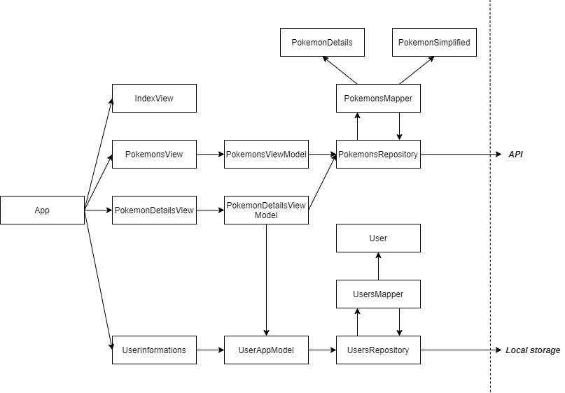

# Enterwell React starter

Ovaj dokument predstavlja službenu dokumentaciju React startera. React starter je nastao zbog želje da se unificiraju svi React projekti koje ćemo u budućnosti razvijati. U ovom dokumentu će stoga biti objašnjeni i navedeni sljedeće zaključci oko kojih su se Enterwell starješine usuglasile nakon višesatnih dogovora:

* arhitektura aplikacije
* organizacija projekta, odnosno njegovih mapa i datoteka
* preporuka paketa koji su se pokazali korisnima u prošlosti

Za bilo kakve nedoumice koje ostanu nakon čitanja ovog dokumenta, slobodno nam se obratite putem GH Issues.

## Zašto React i zašto Next.js?

[React](https://reactjs.org/) je jedna od mnoštva JavaScript librarya i frameworka čiji je cilj olakšati izgradnju korisničkih sučelja. Iza Reacta stoji Facebook čiji projekt to i jest, a što osigurava određenu sigurnost da to nije samo još jedna tehnologija koja će biti hypeana mjesec dana te potom zaboravljena. Zašto se baš React odabrao za razvoj aplikacija, a ne recimo Vue ili Angular, to ne znam, no pošto se pokazalo da je dosta lako i brzo razvijati aplikacije korištenjem njega, nije bilo potrebe za promjenom.

[Next.js](https://nextjs.org/) je jedan od React frameworka koji smo relativno nedavno odlučili koristiti zajedno s Reactom. Njegovo korištenje omogućava lakšu konfiguraciju projekata (bez potrebe za petljanjem s [webpackom](https://webpack.js.org/)), pruža potporu za pre-rendering stranica i još mnoge druge stvari.

## Struktura projekta

U rootu React projekta se nalaze sve konfiguracijske datoteke alata koji se koriste tijekom developmenta i builda aplikacije te mape s različitim cjelinama aplikacije. 

### Datoteke u rootu projekta

* `.babelrc` - služi za konfiguriranje [Babela](https://babeljs.io/)
* `.eslintrc` - služi za konfiguriranje [ESLinta](https://eslint.org/) 
* `.eslintignore` - služi za definiranje datoteka koje neće biti zahvaćene ESLintom
* `.gitignore` - služi za definiranje datoteka čije promjene [Git](https://git-scm.com/) neće pratiti
* `package.json` - služi da definiranje paketa koji se u aplikaciji koriste (tzv. `dependencies` i `devDependencies`)
* `cypress.json` - služi da konfiguriranje [Cypressa](https://www.cypress.io/)
* `yarn.lock` - služi [Yarnu](https://classic.yarnpkg.com/en/) da zna koje točno verzije paketa je potrebno instalirati
* `next.config.js` - služi za navođenje ne-defaultnih konfiguracija Next.jsa
* `README.md` - služi za opis projekta - kako ga pokrenuti, neke osnovne stvari o paketima koji se koriste ili neki drugi savjeti osobama koje će u budućnosti raditi na projektu
* `CHANGELOG.md` - služi za vođenje [evidencije promjena aplikacije](https://keepachangelog.com/en/1.0.0/) (dodavanje novih značajki, popravljanje pogrešaka itd.) 

### Mape u rootu projekta

* `app-models` - mjesto gdje se čuvaju svi tzv. app-modeli koji postoje unutar aplikacije 
* `component-models` - mjesto gdje se čuvaju svi tzv. component-modeli koji postoje unutar aplikacije
* `components` - mjesto gdje se čuvaju sve komponente koje nisu vezane uz samo jedan `view` (tzv. *shared components*)
* `config` - mjesto gdje se čuvaju različite konfiguracijske datoteke koje koristi sama aplikacija (npr. kofiguracija internacionalizacije, Material-UI teme ili nešto drugo)
* `cypress` - mjesto gdje se čuvaju datoteke vezane za Cypress
* `helpers` - mjesto gdje se čuvaju svi tzv. helperi koji postoje unutar aplikacije
* `mappers` - mjesto gdje se čuvaju svi tzv. maperi koji postoje unutar aplikacije
* `models` - mjesto gdje se čuvaju svi modeli koji postoje unutar aplikacije
* `pages` - mjesto čije podmape i datoteke tvore hijerarhiju dostupnim ruta aplikacije
* `public` - mjesto gdje se čuvaju svi statički resursi aplikacije (npr. slike, svg-ovi i datoteke koje se mogu preuzeti kroz aplikaciju)
* `repositories` - mjesto gdje se čuvaju svi repozitoriji koji postoje unutar aplikacije
* `services` - mjesto gdje se čuvaju svi servisi koji postoje unutar aplikacije
* `styles` - mjesto gdje se čuvaju svi globalni stilovi koji postoje unutar aplikacije
* `view-models` - mjesto gdje se čuvaju svi tzv. view-modeli koji postoje unutar aplikacije
* `views` - mjesto gdje se čuvaji svi tzv. viewovi i samo za njih vezane komponente

Detaljnije o tome što su pojedini od ovih entiteta može se pročitati u dijelu o arhitekturi React starter aplikacije. Dodatna napomena: u nekim mapama je moguće pronaći datoteku imena `TODO_delete_this_later.txt` čija je jedina svrha učini mapu nepraznom kako bi ju Git zapamtio.

## Arhitektura

Krenimo odmah *in medias res* - slika neposredno ispod ovog teksta prikazuje arhitekturu Enterwell React aplikacija. Naravno da to nije jedina, a ponajmanje jedina ispravna arhitektura React aplikacija, već je riječ o arhitekturi oko koje su se starješine Enterwella gotovo pa jednoglasno usuglasile. U nastavku će biti objašnjeni različiti segmenti arhitekture.

<div style="margin: 50px 0; text-align: center;">
  
</div>

### Komponente

Srž svake React aplikacije su njene komponente. Komponente su građevni dijelovi aplikacije i njima se definira korisničko sučelje koje će, na kraju krajeva, korisnik vidjeti. U Enterwellovoj React arhitekturi, komponente mogu odgovarati jednoj od sljedeće 3 skupine: `pages`, `views` i `components`.

#### Pages

React aplikacije koje su u Enterwellu razvijane tokom prethodnih godina, za usmjeravanje (eng. *routing*) su koristile `react-router` i slične pakete. Prelaskom na Next.js nestala je potreba za korištenjem tih paketa, a rute (eng. *route*) aplikacije se definiraju hijerarhijom datoteka i mapa unutar [`pages`](https://nextjs.org/docs/basic-features/pages) mape (npr. `pages/index.jsx` datoteka odgovara ruti `/`, `pages/pokemons/index.jsx` datoteka odgovara ruti `/pokemons` itd.).

Pošto je ovakav način usmjeravanja svojstven Next.jsu, te zbog želje da aplikacije budu malo manje spregnute s njim, `pages` komponente služe samo kao enkapsulacija oko `views` komponenti.

Važno je napomenuti da unutar `pages` mape postoje i datoteke koje ne odgovaraju direktno rutama aplikacije. Tu se misli na [`_app.jsx`](https://nextjs.org/docs/advanced-features/custom-app), [`_document.jsx`](https://nextjs.org/docs/advanced-features/custom-document) i [`_error.jsx`](https://nextjs.org/docs/advanced-features/custom-error-page) datoteke koje imaju posebnu ulogu definiranu Next.jsom. 

#### Views

`views` komponente predstavljaju sve ono što korisnik vidi na nekoj ruti aplikacije, a one onda mogu unutar sebe koristiti jednu ili više "običnih" komponenti. Ukoliko `view` komponenta postane previše složena, preporučeno je razložiti ju na više "običnih" komponenti. Ako sw tako dobivene "obične" komponente koriste u samo tom `viewu` i nigdje drugdje, potrebno ih je smjestiti u zasebnu mapu unutar mape tog `viewa`. Komponente koje se koriste na više mjesta u aplikaciji potrebno je smjestiti u zasebnu mapu unutar `components` mapu.

#### Components

`components` komponente predstavljaju sve one komponente koje se koriste na više mjesta u aplikaciji. Komponenta bi se trebala smjestiti u ovu mapu ako se koristi na barem dva mjesta u aplikaciji ili ako je dovoljno općenita da se može koristiti na više mjesta. Kad se tek krene s razvojem aplikacije, sve će komponente biti korištene na samo jednom mjestu, no za neke od njih se može unaprijed pretpostaviti da se mogu iskoristiti na više mjesta. Primjer takvih komponenti su razne `Input` komponente.

### Podaci

Svaka React komponenta ima potporu za perzistenciju podataka u vidu svog `statea`. Ukoliko aplikacija ima malo veće komponente s većom količinom podataka, `state` tih komponenata vrlo lako može postati nepregledan, a same komponente previše zagađene logikom aplikacije. Kako bi se doskočilo tom problemu, s vremenom su se pojavili libraryi koji simuliraju ponašanje `state` (u smislu da aktiviraju re-render komponente kada se promijene podaci o kojima ovisi), ali i omogućuju da se podaci o kojima komponenta ovisi čuvaju izvan nje same. Jedan od tih librarya je i [`mobx`](#defaultni-paketi) koji se koristi u Enterwellovim React aplikacijama.

Općenito, unutar Enterwellovih React aplikacija se kombiniraju oba načina pohrane podataka. Kada su u pitanju forme ili neke komponente s malim brojem podataka koji trebaju čuvati, tada se za pohranu koristi `state`. Kada je riječ o većim komponenata sa složenijom logikom, tada se podaci i logika izdvajaju iz komponenata u zasebne cjeline. U nastavku je navedena hijerahija cjelina za perzistenciju podataka u aplikaciji.

#### App-model

U app-modelima se perzistiraju podaci koji su zajednički cijeloj aplikaciji i koji bi trebali biti očuvani tijekom cijelog vremena korištenja aplikacije, neovisno o ruti na kojoj je korisnik. 

App-modelima komponente mogu pristupiti izravno ili kroz view-model koji treba unutar sebe čuvati referencu na njega. Gotovo uvijek bi trebalo koristiti drugi način pristupanja app-modelima. Prvi način bi se trebao koristiti samo kada su u pitanju neke vršne komponente koje ne pripadaju direktno nijednom `viewu` (npr. layout komponenta koja je jednaka za većinu `viewa` pa je definirana unutar zajedničke `_app.jsx` komponente koja nema svoj view-model).

Osim podataka, app-modeli sadrže i logiku za njihovo dohvaćanje i mijenjanje.

#### View-model

U view-modelima se perzistiraju podaci koji su svojstveni za neki `view`. Ovisno o potrebama, view-modeli se mogu stvari i uništavati zajedno s `viewom` ili mogu postojati tokom cijelog vremena korištenja aplikacije. Kada u aplikaciji postoji `view` s listom nekih podataka (npr. lista svih Pokemona), tada je prikladno koristiti view-modele koji se stvori samo jednom i postoje koliko i aplikacija. Za `viewove` koji odgovaraju detaljima elemenata liste (npr. detalji nekog Pokemona), prikladno je koristiti view-modele koji traju koliko i `view` kojem pripadaju. U potonjem slučaju, kratkotrajni view-modeli su prikladni jer isti `view` služi za prikazivanje više različitih ruta (npr. `/pokemons/1`, `/pokemons/45` itd.) pa se time izbjegava slučaj pogrešnog prikaza podataka prilikom početnog rendera komponente.

Gore navedeni slučajevi su samo primjer te životni vijek view-modela ovisi isključivo o potrebama neke aplikacije. Također, baš kao i app-modeli, view-modeli osim podataka sadrže i logiku za njihovo dohvaćanje i mijenjanje.

#### Component-model

U component-modelima perzistiraju podaci koju su svojstveni za neku `componentu`. Component-modeli se ne bi trebali praviti za sve komponente, već samo za one sa složenijom logikom (npr. kada se isti modal za stvaranje nečeg koristi na više `viewova` u aplikaciji, prikladnije je izdvojiti logiku u component-model, nego ju ponavljati u svakom view-modelu pa prosljeđivati komponenti).

### Logika

Ranije je već spomenuto da se dio logike aplikacije nalazi raspoređen u app-modelima, view-modelima i component-modelima. Logika raspoređena po tim cjelinama bi trebala biti usko vezana samo uz podatke koje oni sadrže. Gledajući prethodnu sliku, vidljivo je da postoji još jedan sloj logike o čijim će cjelinama biti riječ u ovom dijelu.

#### Model

Modeli su razredi koji predstavljaju entitete koji se koriste u aplikaciji. Podaci koji se dohvate sa servera (ili iz drugog izvora podataka) trebaju se premapirati u odgovarajuće modele.

#### Mapper

Maperi su razredi koje pružaju uslugu mapiranja podataka. Najčešći slučaj kad se koriste je prilikom mapiranja podataka sa servera u modele koji se koriste u aplikaciji. Prilikom mapiranja, nad pojedinim podacima je moguće napraviti prikladne transformacije (npr. formatiranje datuma, lokaliziranja podataka itd.).

#### Repository

Repozitoriji su razredi koji služena kao svojevrsna granica aplikacije i preko kojih aplikacija dohvaća podatke. Kako će se podaci dohvaćati, to ovisi isključivo o repozitoriju odnosno samoj aplikaciji. Najčešći način dohvaća podatak jest s API-ja, no podaci se npr. mogu dohvaćati i iz `local storagea`.

Metode repozitorija unutar se pozivaju logiku za mapiranje podataka koje dohvate.

#### Service

Servisi su razredi koju pružaju u aplikaciji pružaju neku specifičnu ulogu, npr. prikazivanje notifikacija, komunikaciju s `local storageom`, komunikaciju s API-ijem ili nešto drugo.

#### Helper

Helperi (u nedostatku prikladne hrvatske riječi, mogli bismo ih nazvati i korisne funkcije?) su razredi svrhom vrlo slični servisima, no ipak malo manje specifični te najčešće pružaju neku "glupu" uslugu koja se ponavlja na više mjesta u aplikaciji.

### Primjer arhitekture

<div style="margin: 50px 0; text-align: center;">
  
</div>

Da sve ovo ne bi bilo samo mrtvo slovo na ekranu, u sklopu React startera je napravljena i jedna manja aplikacija koja implementira prethodno opisanu arhitekturu. Aplikacija u svom radu koristi PokéAPI te, kao što se već da naslutiti, služi za pregledavanje Pokemona.

Aplikaciju čine 3 "pametne" i 2 "glupe" stranice. Glupi stranice su one na koje korisnik inače neće svojevoljno doći gledati sadržaj, već će tamo bit preusmjeren u određenim situacijama. Te dvije "glupe" stranice su `_error.jsx` i `404.jsx`. `_error.jsx` se korisniku prikaže kada dođe do pogreške u aplikaciji, a `404.jsx` kada korisnik upiše rutu koja nije definirana. "Pametne" stranice su `index.jsx` (koji odgovara ruti `/`), `pokemons/index.jsx` (koji odgovara ruti `/pokemons`) i `pokemons/[id].jsx` (koji odgovara ruti `/pokemons/{pokemon-id}`). `index.jsx` stranica u ovoj aplikaciji prikazuje samo poruku da se tu ne može ništa vidjeti te usmjerava korisnika na stranicu s Pokemonima. `pokemons/index.jsx` prikazuje listu Pokemona s paginacijom. Klikom na pojedinog Pokemona s liste, otvara se `pokemons/[id].jsx` stranica koji prikazuje njegove detalje. Na `pokemons/index.jsx` i  `pokemons/[id].jsx` stranicama u desnom gornjem kutu se prikazuje komponenta u koju korisnik može unijeti svoje ime.

Pošto `index.jsx` stranica ne čuva nikakve podatke, za nju ni nije vezana nikakva logika pa u nastavku neće više biti spominjana.

Stranica `pokemons/index.jsx` prikazuje listu Pokemona koji se dohvaćaju s PokéAPI-ja. Komponenta koja odgovara toj stranici unutar sebe čuva primjerak `PokemonsViewModela`. Iako se taj view-model dohvaća svaki put kada korisnik dođe na tu rutu, za vrijeme korištenja aplikacije postoji samo jedna instanca tog view-modela (ako se baš ne napravi osvježavanje stranice ili ju se zatvori i opet otvori). Koristeći metode `PokemonsViewModela`, komponenta poziva dohvaćanje podataka te ih nakon toga prikazuje. `PokemonsViewModel` unutar sebe za dohvaćanje Pokemona koristi `PokemonsRepository` koji komunicira s API-jem. Nakon što se podaci dohvate s API-ja, `PokemonsRepository` ih proslijedi `PokemonsMapperu` koju ih premapira u `PokemonSimplified` modele i vrati natrag repozitoriju, a on zatim view-modelu. 

Stranica `pokemons/[id].jsx` prikazuje detalje Pokemona koji se dohvaćaju s PokéAPI-ja. Komponenta koja odgovara toj stranici unutar sebe čuva primjerak `PokemonDetailsViewModela`. Za razliku od `PokemonsViewModela`, ne postoji samo jedna instanca `PokemonDetailsViewModela`, već se svaki put stvori nova (svaki put kad korisnik dođe na tu stranicu). Dohvaćanje detalja Pokemona funkcionira jednako kao i dohvaćanje liste njih - koriste se isti repozitorij i maper, a jedino se podaci mapiraju u drugi model. Još jedna razlika ove stranice u odnosu na `pokemons/index.jsx` je što je ovo stranici potreban podatak o nazivu trenutnog korisnika koji se čuva na razini aplikaciju u `UserAppModelu`. Instanca `UserAppModela` je stoga stranici dostupna kroz njen view-model. `UserAppModel` podatke o korisniku dohvaća korištenjem `UserAppRepository` koji komunicira s `local storageom`.

Komponente korištene unutar ove pokazne aplikacije nisu nužno usklađene s komponenatam kakve bi trebalo na "pravim" aplikacijama koristit. Ovo se prije sve odnosi na `LoadingContainer` komponentu oko koje se lome koplja i koja bi se po nekima trebala drugačije ponašati.

## Stilovi

Svaka komponenta (bilo da je riječ o `component` ili `view`) treba imati vlastite stilove. Stilovi se smještaju u istu mapu gdje je i datoteka komponente, a datoteka stilova se može prepoznati po nastavku `.module.scss`. Iznimka su globalni stilovi koji se odnose na cijelu aplikaciju i koji su smješteni u `styles` mapi. Kao globalni stilovi se definiraju i boje koje se koriste na više mjesta u aplikaciji te koje se na taj način mogu koristiti bez potrebe da ih se uvijek iznova piše (ovo je posebno prigodno kod glavnih boja teme koja se provlači kroz cijelu aplikaciju). Važno je napomenuti i da ne treba apsolutno sve boje izvlačiti u globalne stilove, pogotovo ako će se one koristiti samo na jednom mjestu.

## Imenovanje

Imenovanje je nešto što uvijek izazive prijepore jer većina nas ima neki svoj stil koji preferira. I tijekom dogovaranja ovog React startera bilo je takvih problema, i svak je vukao na svoju stranu. Bilo je teško, a tvorci Reacta nisu bili baš od pomoći, pošto nikakva službena konvencija ne postoji. Promatranjem drugih React projekata, došli smo do odluka opisanih u nastavku.

### Imenovanje mapa

* Prilikom imenovanja mapa u root mapi, koristi se `kebab-case` (sve riječi se pišu malim slovima i međusobno su odvojene crticom)
* Prilikom imenovanja mapa u podmapama, koristi se `PascalCase` (sve riječ se pišu velikim početnim slovom i međusobno nisu odvojene)
* Iznimka od prošlog pravila su podmape mapa `pages` i `public` koje se također pišu `kebab-caseom`

### Imenovanje datoteka

* Konfiguracijske datoteke root mape ne podliježu nikakvim pravilima već se pišu u obliku koji je zahtjevan od strane alata koji ih koriste
* Sve datoteke u `pages` i `styles` mapama pišu se `kebab-caseom`
* Sve datoteke koje predstavljaju React komponente te datoteke iz koji se `exporta` neka klasa ili više funkcija pišu se `PascalCaseom`
* Datoteke iz koji se `exporta` instanca nekog razreda (eng. *class*) ili objekt pišu se `camelCaseom` (prva riječ se piše malim početnim slovom, a preostale velikim te međusobno nisu odvojene)
* Datoteke "lokalnih" stilova pišu se `PascalCaseom` uz ekstenziju `.module.scss` 
* Datoteke iz `public` mape ne podliježu nikakvim pravilima

## Testiranje

Pisanjem testova, automatizira se provjera radi li sve u aplikaciji kako treba. Automatizirani testovi su korisni jer se ne moraju ručno testirat sve funkcionalnosti svaki put kada se promjeni nešto u aplikaciji.

Cypress je odabran kao najprikladniji library za testiranje rada aplikacije. U sklopu ovog React startera, napisani su samo integracijski testovi za svaki od `viewova`, no nekad će biti prikladno pisati i unit testove za pojedine komponente. Integracijski testovi `viewova` bi trebali neki minimum toga što bi u aplikaciji trebalo testirati.

Testovi se mogu pokrenuti direktno iz komandne linije korištenjem naredbe

```
yarn test
```

ili se može otvoriti UI preko kojeg se mogu ručno pokretati. UI se otvara naredbom

```
yarn test-open
```

Ponekad neki testovi ne prolaze kada se pokrenu preko komandne linije pa je preporuka uvijek ih pokretati korištenjem UI-a.

## Paketi

Pogledom na `package.json` može se okvirno dobiti dojam o nekim paketima koji se koriste. U React starter su uključeni samo osnovni paketi za koje smatramo da će uvijek biti korišteni u aplikaciji, no tu je još i cijeli set drugih paketa koji se koriste po potrebi. 

Jedno od pitanja koje se postavlja tijekom dodavanja paketa jest treba li ih dodati kao `dependencies` ili kao `devDependencies`. Granica je mutna, ali recimo da bi se u `dependencies` trebalo dodati sve ono bez čega aplikacija ne može raditi na produkciji, dok `devDependencies` obuhvaćaju pakete koji se koriste tijekom razvoja. Ne treba doduše toliko razbijati glavu oko toga jer će aplikacije koje mi razvijamo raditi ispravno neovisno o tome.

### Defaultni paketi 

U nastavku su navedeni paketi koji su po defaultu dodani u projekt te koji će se vrlo vjerojatno koristiti u aplikaciji. Ukoliko se ispostavi da za nekim od njih nema potrebe, slobodno ih se može izbaciti. Napomena: nisu opisani paketi koji predstavljaju alate za pomoć developmenta i builda aplikacije (`babel`, `eslint`, `next`...).

* [`react`](https://reactjs.org/) / [`react-dom`](https://reactjs.org/docs/react-dom.html) - library čija je uloga već ranije opisana,a koji stoji i u samom nazivu startera što implicira da ga je nemoguće ne koristiti 
* [`mobx`](https://mobx.js.org/README.html) / [`mobx-react-lite`](https://mobx-react.js.org/) - state management library koji omogućava odvajanje aplikacijske logike od iscrtavanja komponenti (omogućava da promjene podataka izazovu ponovno renderiranje komponenata - ima sličan učinak kao i state komponente samo nije nužno vezan za nju)
* [`cypress`](https://www.cypress.io/) - library koji omogućava pisanje testova za aplikaciju
* [`@material-ui/core`](https://material-ui.com/) / [`@material-ui/icons`](https://material-ui.com/components/material-icons/) - kolekcija React komponenata i ikona koja omogućava da ne izmišljamo toplu vodu pisanjem vlastitih button, input i inih komponenti
* [`axios`](https://github.com/axios/axios) - HTTP klijent koji omogućava jednostavnu komunikaciju aplikacije sa serverom odnosno API-jem
* [`noty`](https://ned.im/noty/#/) - library korišten za prikazivanje notifikacija unutar aplikacije
* [`clsx`](https://github.com/lukeed/clsx) - paket koji pojednostavljuje uvjetovano postavljanje klasa HTML elementima/React komponenatam

### Dodatni paketi

Pošto cilj ovog startera nije pretrpati ga sa svim mogućim paketima koji bi se mogli koristit, mnoge od njih će trebati dodatno dodati po potrebi. U nastavku je naveden popis paketa koje je preporučeno koristiti ukoliko se javi potreba za opisanom funkcionalnošću aplikacije koju taj paket pruža. 

Ukoliko nijedan od navedenih paketa ne odgovara željama i potrebama, potrebno je dodati neki po vlastitom izboru. [npm](https://www.npmjs.com/) je mjesto gdje se može pronaći poneki paket za svakog.

* [`@enterwell/react-form-validation`](https://github.com/Enterwell/react-form-validation) - "domaći" paket za rad s React formama koji prvenstveno omogućava njihovu laganu validaciju
* [`@enterwell/enum-helper`](https://github.com/Enterwell/js-enum-helper) - također "domaći" paket koji olakšava rad s enumima
* [`@material-ui/lab`](https://material-ui.com/components/about-the-lab/) - dodatna kolekcija Material-UI komponenti koje još nisu postale sastavni dio core kolekcije
* [`@material-ui/pickers`](https://material-ui-pickers.dev/) - kolekcija komponenata za odabir vremena i datuma također razvijena od strane Material-UI tima
* [`sentry`](https://sentry.io/welcome/) - paket za praćenje pogrešaka aplikacije (tzv. _error monitoring_)
* [`i18next`](https://www.i18next.com/) / [`react-i18next`](https://react.i18next.com/) - framework za internacionalizaciju aplikacije s minimalnim overheadom
* [`moment`](https://momentjs.com/) - library koji olakšava rad datumima i vremenima

## Pokretanje aplikacije

Prije nego se započne s razvijanjem aplikacije, potrebno je instalirati sve pakete koje ona koristi. Preporučeni način za to napraviti je korištenjem Yarna i naredbe

```
yarn install
```

Jednom kad su svi paketi instalirani, moguće je pokrenutni samu aplikaciju. Više je naredbi kojima se to može napraviti, a sve ovisi o tome želi li se aplikacija pokrenut u `development` ili `production` modeu i želi li se koristiti lokalni API ili ne.

Pokretanje aplikacije u `development` modeu uz korištenje remote API-ja vrši se naredbom

```
yarn dev
```

</br>

Pokretanje aplikacije u `development` modeu uz korištenje lokalnog API-ja vrši se naredbom

```
yarn dev-local
```

Pokretanje aplikacije u `production` modeu uz korištenje remote API-ja vrši se naredbom

```
yarn dev-prod
```

Pokretanje aplikacije u `production` modeu uz korištenje lokalnog API-ja vrši se naredbom

```
yarn dev-prod-local
```

</br>

Kad je razvoj aplikacije gotov, aplikaciju je potrebno `buildati`. `build` aplikacije vrši se naredbama

```
yarn build
```
```
yarn build-local
```

ovisno o tome hoće li aplikacija koristiti lokalni ili remote API.
